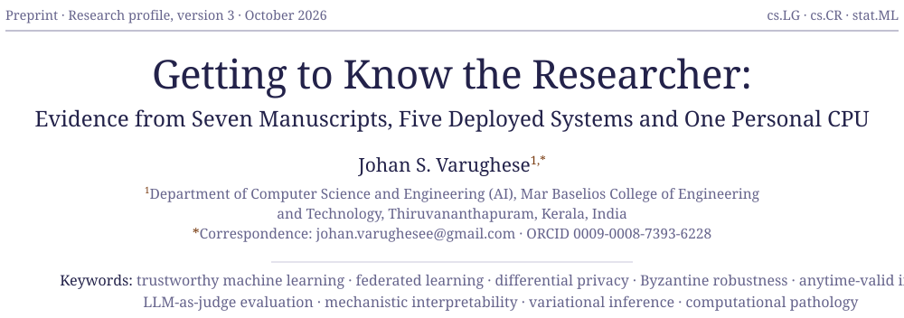
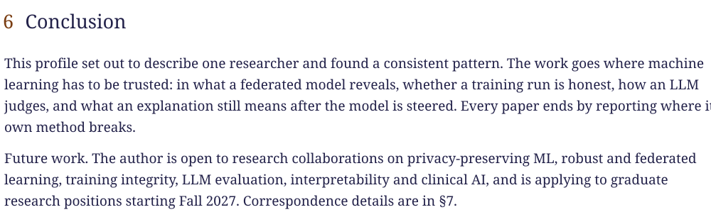
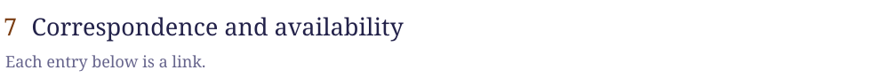

<a href="https://johansv.netlify.app">
<picture>
  <source media="(prefers-color-scheme: dark)" srcset="assets/title-dark.svg" />
  
</picture>
</a>

 

<picture>
  <source media="(prefers-color-scheme: dark)" srcset="assets/abstract-dark.svg" />
  
</picture>

  

<picture>
  <source media="(prefers-color-scheme: dark)" srcset="assets/plate-dark.svg" />
  
</picture>

  

<picture>
  <source media="(prefers-color-scheme: dark)" srcset="assets/program-dark.svg" />
  
</picture>

  

<picture>
  <source media="(prefers-color-scheme: dark)" srcset="assets/manuscripts-dark.svg" />
  
</picture>

  

<picture>
  <source media="(prefers-color-scheme: dark)" srcset="assets/systems-dark.svg" />
  
</picture>

  

<picture>
  <source media="(prefers-color-scheme: dark)" srcset="assets/bench-dark.svg" />
  
</picture>

  

<picture>
  <source media="(prefers-color-scheme: dark)" srcset="assets/methods-dark.svg" />
  
</picture>

  

<picture>
  <source media="(prefers-color-scheme: dark)" srcset="assets/conclusion-dark.svg" />
  
</picture>

  

<picture>
  <source media="(prefers-color-scheme: dark)" srcset="assets/availability-dark.svg" />
  
</picture>
<a href="mailto:johan.varughesee@gmail.com"><picture><source media="(prefers-color-scheme: dark)" srcset="assets/link-mail-dark.svg" /></picture></a>
<a href="https://johansv.netlify.app"><picture><source media="(prefers-color-scheme: dark)" srcset="assets/link-web-dark.svg" /></picture></a>
<a href="https://orcid.org/0009-0008-7393-6228"><picture><source media="(prefers-color-scheme: dark)" srcset="assets/link-orcid-dark.svg" /></picture></a>
<a href="https://linkedin.com/in/johan-s-varughese"><picture><source media="(prefers-color-scheme: dark)" srcset="assets/link-linkedin-dark.svg" /></picture></a>
<a href="https://github.com/jo-sh-varughese/biomarkher2-ai"><picture><source media="(prefers-color-scheme: dark)" srcset="assets/link-code-dark.svg" /></picture></a>
