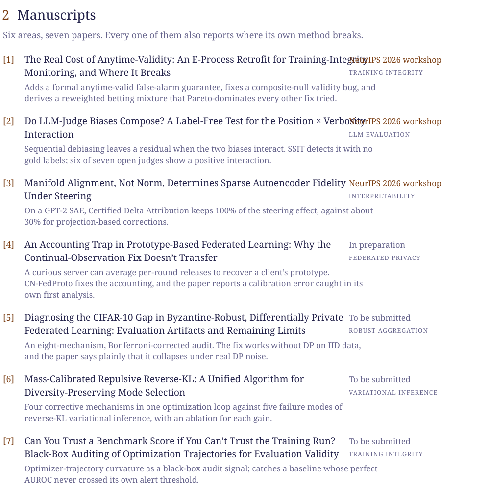

<picture>
  <source media="(prefers-color-scheme: dark)" srcset="assets/abstract-dark.svg" />
  
</picture>

Find me at [johansv.netlify.app](https://johansv.netlify.app), on [ORCID](https://orcid.org/0009-0008-7393-6228) and [LinkedIn](https://linkedin.com/in/johan-s-varughese), or by [email](mailto:johan.varughesee@gmail.com).

 

<picture>
  <source media="(prefers-color-scheme: dark)" srcset="assets/program-dark.svg" />
  
</picture>

  

<picture>
  <source media="(prefers-color-scheme: dark)" srcset="assets/manuscripts-dark.svg" />
  
</picture>

  

<picture>
  <source media="(prefers-color-scheme: dark)" srcset="assets/systems-dark.svg" />
  
</picture>

The code for BiomarkHER2 is at [jo-sh-varughese/biomarkher2-ai](https://github.com/jo-sh-varughese/biomarkher2-ai).

 

<picture>
  <source media="(prefers-color-scheme: dark)" srcset="assets/bench-dark.svg" />
  
</picture>

  

<picture>
  <source media="(prefers-color-scheme: dark)" srcset="assets/methods-dark.svg" />
  
</picture>

  

Open to research collaborations on privacy-preserving ML, training integrity, interpretability and clinical AI, and to graduate positions starting Fall 2027. [Write to me](mailto:johan.varughesee@gmail.com).
